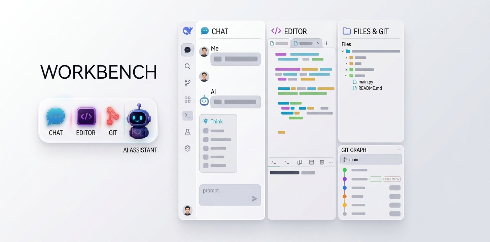
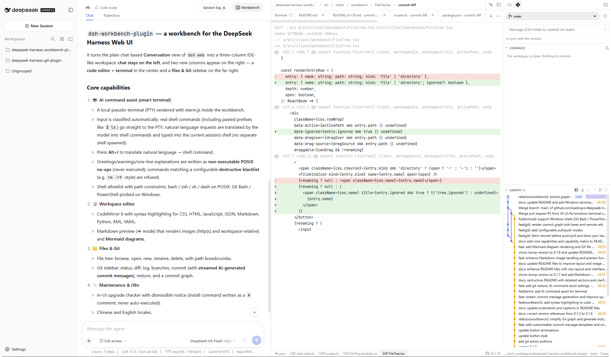
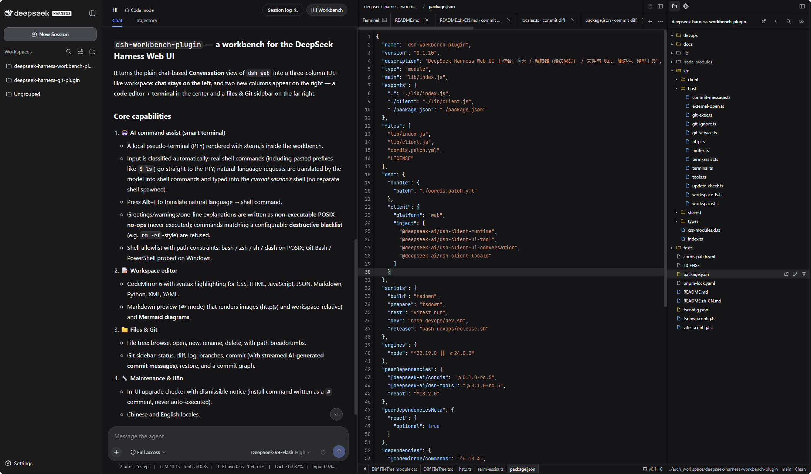
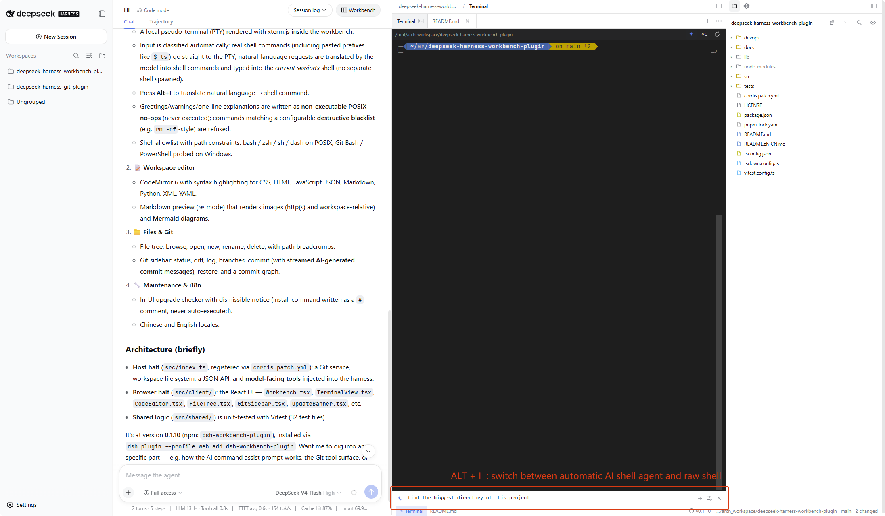
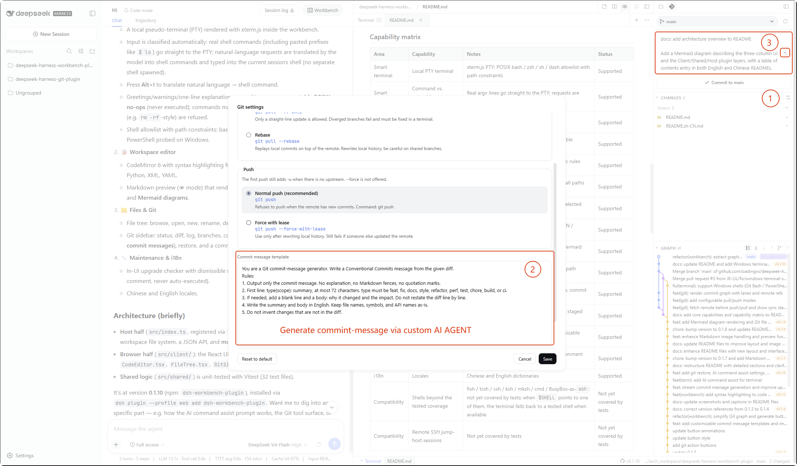
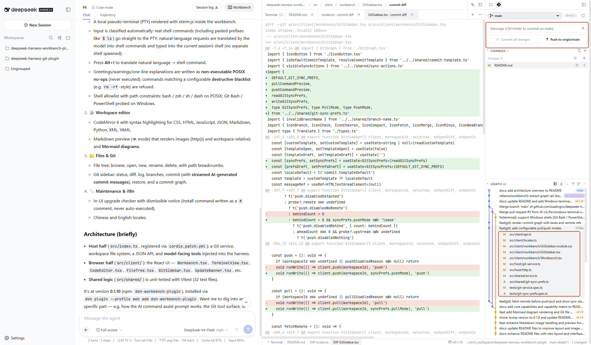
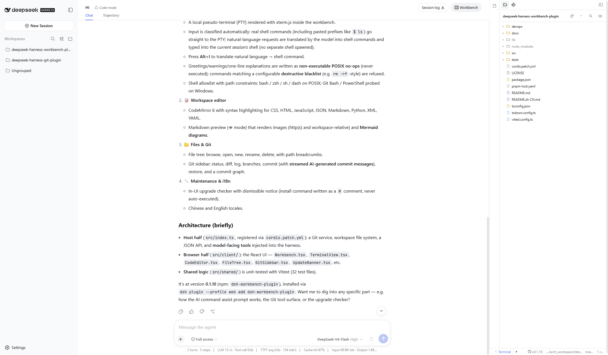

A workbench plugin for the [DeepSeek Harness](https://github.com/deepseek-ai/deepseek-harness) Web UI. After Workbench is opened in Conversation, chat stays on the left. Two new columns appear on the right: the editor (syntax highlighting and terminal) and files & Git.

## Contents

- [Architecture](#architecture)
- [Core capabilities](#core-capabilities)
- [Capability matrix](#capability-matrix)
- [Release](#release)
- [Installation](#installation)
- [Upgrade](#upgrade)
- [Interface](#interface)
- [Workspace terminal](#workspace-terminal)
- [AI command assist](#ai-command-assist)
- [License](#license)

## Core capabilities

1. **Smart terminal.** A local pseudo-terminal (PTY) inside the workbench. Input is classified automatically — lines that are real shell commands (including pasted prompt prefixes like `$ ls`) go straight to the PTY, while natural-language tasks are translated by the model into shell commands and typed into the **current session** shell; no separate shell is started. Greetings, warnings and one-line explanations are written as non-executable POSIX no-ops, and commands matching the configurable destructive blacklist are refused with a note.
2. **Workspace editor.** CodeMirror 6 with syntax highlighting for CSS, HTML, JavaScript, JSON, Markdown, Python, XML and YAML, plus a Markdown preview (👁 mode) that renders images (http(s) and workspace-relative paths) and Mermaid diagrams.
3. **Files & Git.** A file tree (browse, open, new, rename, delete) and a Git sidebar (status, diff, log, branch, commit with streamed AI commit-message generation, restore, commit graph).
4. **Maintenance & i18n.** In-UI upgrade checker with a dismissible notice, and Chinese / English locales.

## Capability matrix

| Area | Capability | Notes | Status |
| --- | --- | --- | --- |
| Smart terminal | Local PTY terminal | xterm.js PTY; POSIX bash / zsh / sh / dash allowlist with path constraints | Supported |
| Smart terminal | Command vs. natural-language classification | Real argv lines go straight to the PTY; requests are translated by the model | Supported |
| Smart terminal | AI translation to shell commands | <kbd>Alt</kbd>+<kbd>I</kbd>; written into the current session shell | Supported |
| Smart terminal | Note isolation | Greetings / warnings written as non-executable statements, never executed | Supported |
| Smart terminal | Destructive command blacklist | Matching commands are refused with a note; rules configurable in settings | Supported |
| Smart terminal | Windows terminal — Git Bash | Probed at the standard Git for Windows install paths and selected when present | Supported |
| Smart terminal | Windows terminal — Windows PowerShell | Probed at the system PowerShell path and selected when Git Bash is absent | Supported |
| Editor | Syntax highlighting | CodeMirror 6: CSS / HTML / JavaScript / JSON / Markdown / Python / XML / YAML | Supported |
| Editor | Markdown preview | Images (http(s) + workspace-relative) and Mermaid diagrams | Supported |
| Files & Git | File tree | Browse / open / new / rename / delete with path breadcrumbs | Supported |
| Files & Git | Git sidebar | Status / diff / log / branch / commit / restore, commit graph | Supported |
| Files & Git | AI commit messages | Streamed commit-message generation from staged changes | Supported |
| Workbench | Three-column layout | Chat \| editor + terminal \| files & Git; drag-resizable with remembered widths | Supported |
| Maintenance | Upgrade checker | Notice + install command written as a `#` comment into the terminal | Supported |
| i18n | Locales | Chinese and English dictionaries | Supported |
| Compatibility | Shells beyond the tested coverage | fish / tcsh / csh / ksh / mksh / cmd / BusyBox-as-`ash`: not yet covered by tests; when `$SHELL` points to one of them, the terminal falls back to a tested shell when available | Not yet covered by tests |
| Compatibility | Remote SSH jump-host sessions | Not yet covered by tests | Not yet covered by tests |

## Release

| Item | Description |
| --- | --- |
| Package | [`dsh-workbench-plugin`](https://www.npmjs.com/package/dsh-workbench-plugin) |
| Version | **0.1.10** (npm tag `latest`) |
| Registry | https://registry.npmjs.org |

```
+ dsh-workbench-plugin@0.1.10
```

Maintainers publish with `bash devops/release.sh`. The script uses the existing `npm login` session on this machine. Credentials must not be stored in the repository.

## Installation

### Prerequisites

[DeepSeek Harness](https://github.com/deepseek-ai/deepseek-harness) is installed, and `dsh web` can be started.

### Procedure

1. Install the plugin:

```bash
dsh plugin --profile web add dsh-workbench-plugin
```

2. Restart `dsh web`.
3. Open http://127.0.0.1:3080, enter **Conversation**, and select **Workbench** in the header.

## Upgrade

### Automatic notice

When a lower version is already installed, a dismissible notice appears at the top of the Files / Git sidebar. The upgrade description and install command are written to the workspace terminal as `#` comments and are not executed. Remove the leading `#`, press Enter, then restart `dsh web`.

```bash
# dsh plugin --profile web add dsh-workbench-plugin@<latest>
```

If the registry lookup fails, no notice is shown. Dismissing the notice skips only that latest version; a subsequent newer release will prompt again.

### Upgrading from 0.1.1

**Version 0.1.1 does not include the upgrade checker and will not display the notice.** Install 0.1.10 manually using the command above. Later releases will prompt in the UI.

## Interface

The workbench uses a three-column layout. Conversation stays on the left. The two columns on the right are the new capability area: editor and terminal in the center, file tree and Git on the far right.








Markdown preview (the 👁 mode in the editor) renders images (http(s) and workspace-relative paths) and Mermaid diagrams (```mermaid fenced blocks, powered by [mermaid.js](https://mermaid.js.org/) 11).

## Workspace terminal

The workspace terminal is a local pseudo-terminal (PTY). AI command assist converts natural language into shell commands and writes them into the **current session** shell; greetings and notes are written as non-executable statements and are never executed. Shell coverage — tested and not yet tested — is summarized in the [capability matrix](#capability-matrix).

### Allowed shells — POSIX

| Name | Selection criteria | Assist verification |
| --- | --- | --- |
| **bash** | `$SHELL` is bash; otherwise the default when `$SHELL` is not one of the remaining rows | Verified (including `failglob` and interactive history expansion) |
| **zsh** | `$SHELL` is zsh | Verified (including default `nomatch`). Interactive zsh does **not** treat `#` as a comment by default, so notes are not written as a bare `#` line |
| **sh** | `$SHELL` is sh; otherwise the fallback when bash and zsh are unavailable | Verified. `/bin/sh` may be a symlink to bash or dash; the symlink target is used as-is |
| **dash** | Only when `$SHELL` is explicitly dash (`/bin/dash`, `/usr/bin/dash`, or `/usr/local/bin/dash`) | Same POSIX `:` no-op as sh. Dash is **not** included in the default candidate list |

### Allowed shells — Windows

| Name | Selection criteria | Assist verification |
| --- | --- | --- |
| **Git Bash** | Probed at `C:/Program Files/Git/bin/bash.exe` and `C:/Program Files/Git/usr/bin/bash.exe`; selected when present | Not yet covered by tests |
| **Windows PowerShell** | Probed at `%SystemRoot%/System32/WindowsPowerShell/v1.0/powershell.exe`; selected when Git Bash is absent | Not yet covered by tests |

### Path constraints

Absolute paths are accepted only under `/bin`, `/usr/bin`, or `/usr/local/bin`, and only for the four POSIX names in the table above (for example `/bin/bash`, `/usr/bin/zsh`). On Windows, absolute paths to the Git Bash and PowerShell executables are accepted. All other paths, including custom installs under a home directory, are ignored so that unknown programs are not executed.

### Selection order

On Windows, Git Bash is probed first, followed by the system PowerShell, then the POSIX candidates below. The POSIX order is:

1. `$SHELL` (must be on the allowlist)
2. `/bin/bash`
3. `/usr/bin/bash`
4. `/bin/zsh`
5. `/usr/bin/zsh`
6. `/bin/sh`
7. `/usr/bin/sh`

If none of these paths are available, the terminal cannot start. Shells not yet covered by tests (fish, tcsh, csh, ksh, mksh, cmd, and BusyBox invoked as `ash`) are listed in the [capability matrix](#capability-matrix): when `$SHELL` points to one of them, the value is ignored and the terminal falls back to a tested shell when available. BusyBox is treated as **sh** only when the operating system exposes it as `/bin/sh`; the name `ash` is not yet covered by tests.

## AI command assist

<kbd>Alt</kbd>+<kbd>I</kbd> translates natural-language requests into shell commands and writes them into the shell of the current session; no separate shell is started. Greetings, warnings, and the one-line explanation preceding a command are written as non-executable statements and are never executed.

## License

MIT
