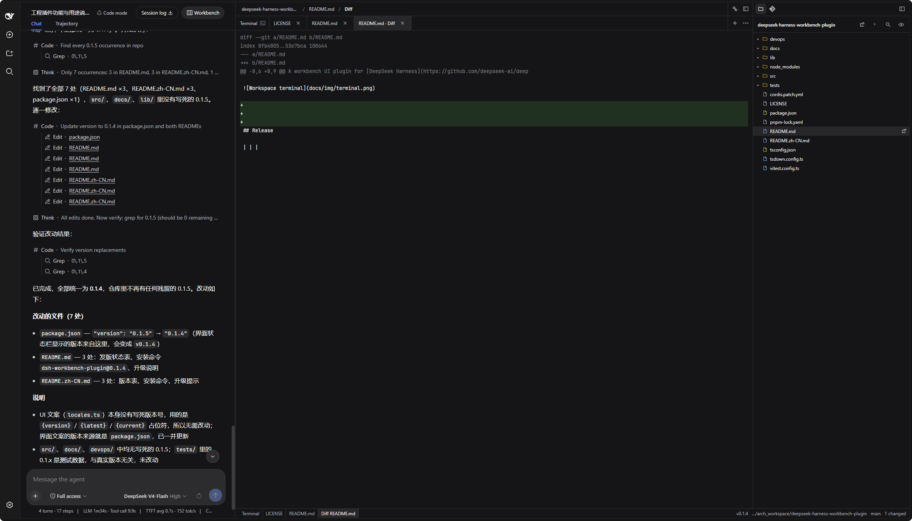

DeepSeek Harness Web UI 工作台插件。在「对话」视图中打开工作台后，对话保留在左侧；右侧新增两栏，分别承载编辑器（含语法高亮与终端）以及文件与 Git。


## 目录

- [架构](#架构)
- [核心能力](#核心能力)
- [能力矩阵](#能力矩阵)
- [发行信息](#发行信息)
- [安装](#安装)
- [升级](#升级)
- [界面](#界面)
- [工作区终端](#工作区终端)
- [AI 命令助手](#ai-命令助手)
- [许可证](#许可证)

## Interface

The workbench uses a three-column layout. Conversation stays on the left. The two columns on the right are the new capability area: editor and terminal in the center, file tree and Git on the far right.


## 核心能力

1. **智能终端**：工作台内置本地伪终端（PTY）。输入会被自动分类——真正的 shell 命令（含粘贴的提示符前缀，如 `$ ls`）直接写入终端；自然语言任务则由模型翻译为 shell 命令，写入**当前会话**所用的 shell，不启动独立 shell。问候、风险说明与命令前的一行解释以不可执行的 POSIX 空操作写入，绝不执行；命中可配置黑名单的危险命令会被拒绝并给出提示。
2. **工作区编辑器**：基于 CodeMirror 6，支持 CSS、HTML、JavaScript、JSON、Markdown、Python、XML、YAML 语法高亮；Markdown 预览（👁 模式）支持渲染图片（`http(s)` 与工作区相对路径）与 Mermaid 图表。
3. **文件与 Git**：文件树（浏览、打开、新建、重命名、删除）与 Git 侧栏（status / diff / log / branch / commit——含 AI 流式生成提交信息、restore、提交图）。
4. **维护与国际化**：界面内升级检查（可关闭提示）与中 / 英双语词典。

## 能力矩阵

| 能力领域 | 能力点 | 说明 | 状态 |
| --- | --- | --- | --- |
| 智能终端 | 本地 PTY 终端 | 基于 xterm.js；POSIX 白名单 bash / zsh / sh / dash 及路径约束 | 已支持 |
| 智能终端 | 命令与自然语言自动分类 | 真实 argv 行直接写入终端；请求交给模型翻译 | 已支持 |
| 智能终端 | 多终端标签 | <kbd>Alt</kbd>+<kbd>J</kbd> 新建标签；每个标签各自持有独立的 PTY 会话 | 已支持 |
| 智能终端 | 自然语言翻译为 shell 命令 | <kbd>Alt</kbd>+<kbd>I</kbd> 唤起，写入当前会话 shell | 已支持 |
| 智能终端 | 说明语句执行隔离 | 问候 / 警告写为不可执行语句，永不执行 | 已支持 |
| 智能终端 | 危险命令黑名单 | 命中黑名单的命令拒绝代执行并提示；规则可在设置中增删 | 已支持 |
| 智能终端 | Windows 终端 — Git Bash | 探测标准 Git for Windows 安装路径，存在即选用 | 已支持 |
| 智能终端 | Windows 终端 — Windows PowerShell | 探测系统 PowerShell 路径，Git Bash 不可用时选用 | 已支持 |
| 编辑器 | 多语言语法高亮 | CodeMirror 6：CSS / HTML / JavaScript / JSON / Markdown / Python / XML / YAML | 已支持 |
| 编辑器 | Markdown 预览 | 图片（`http(s)` 与工作区相对路径）与 Mermaid 图表 | 已支持 |
| 文件与 Git | 文件树 | 浏览 / 打开 / 新建 / 重命名 / 删除，路径面包屑 | 已支持 |
| 文件与 Git | Git 侧栏 | status / diff / log / branch / commit / restore、提交图 | 已支持 |
| 文件与 Git | AI 提交信息 | 依据暂存变更流式生成提交信息 | 已支持 |
| 工作台 | 三栏布局 | 对话 \| 编辑器 + 终端 \| 文件与 Git；拖拽调宽并记忆宽度 | 已支持 |
| 维护 | 版本升级检查 | 界面提示 + 将安装命令以 `#` 注释写入终端 | 已支持 |
| 国际化 | 语言包 | 中 / 英双语词典 | 已支持 |
| 兼容性 | 测试覆盖以外的 shell | fish / tcsh / csh / ksh / mksh / cmd / 以 `ash` 为名的 BusyBox；`$SHELL` 指向其中之一时，可用时回退至已覆盖的 shell | 未测试覆盖 |
| 兼容性 | 远程 SSH 跳板会话 | 尚未纳入测试覆盖 | 未测试覆盖 |

## 发行信息

| 项目 | 说明 |
| --- | --- |
| 包名 | [`dsh-workbench-plugin`](https://www.npmjs.com/package/dsh-workbench-plugin) |
| 当前版本 | **0.1.13**（npm 标签 `latest`） |
| 软件源 | https://registry.npmjs.org |

```
+ dsh-workbench-plugin@0.1.13
```

维护者发布 npm 请执行 `bash devops/release.sh`。该脚本使用本机已有的 `npm login` 会话；不得将账号或凭据写入仓库。

应用市场走 GitHub 安装（`github:loadingvx/deepseek-harness-workbench-plugin`），**不会在用户机器上编译**。每次推 GitHub 之前先执行 `bash devops/build.sh`，把 `lib/index.js` 和 `lib/client.js` 与源码一起提交。

## 安装

### 前置条件

已安装 [DeepSeek Harness](https://github.com/deepseek-ai/deepseek-harness)，并且能够启动 `dsh web`。

### 步骤

1. 安装插件（必须带版本号，不要省略 `@0.1.13`）：

```bash
dsh plugin --profile web add dsh-workbench-plugin@0.1.13
```

`dsh plugin add` 底层是 pnpm。pnpm 11 默认要等一个版本**发布满 24 小时**才会把它当成 `latest`。只写 `dsh-workbench-plugin`、不带 `@版本号` 时，可能静默装上 **0.1.0**，而且命令仍然成功退出。写上 `@0.1.13` 才会明确要这一版。

若指定版本后仍提示太新、装不上，在 `~/.dsh/profiles/web/pnpm-workspace.yaml` 加上下面两行，再执行一次安装命令：

```yaml
minimumReleaseAgeExclude:
  - dsh-workbench-plugin
```

2. 重启 `dsh web`。
3. 访问 http://127.0.0.1:3080 ，进入「对话」并新建会话。工作台会立刻在右侧打开，不必先提问。发出第一轮对话后，标题栏的 **工作台** 按钮可以随时开关。

### 应用市场 / GitHub

市场分配的安装命令装的是 GitHub 仓库，不是 npm 包：

```bash
dsh plugin --profile web add github:loadingvx/deepseek-harness-workbench-plugin
```

默认分支里必须已经有构建好的 `lib/index.js` 和 `lib/client.js`。只提交源码会装不上：pnpm 默认拦截 git 包的 `prepare` 构建脚本，用户会看到 `allowBuilds` 报错。装完后同样重启 `dsh web`，再打开工作台。

## 升级

### 自动提示

若当前环境已安装较低版本，文件与 Git 侧栏顶部将显示可关闭的升级提示。升级说明及安装命令会写入工作区终端，并以 `#` 开头（作为注释，不会被执行）。去掉行首 `#` 后按回车即可安装；安装完成后须重启 `dsh web`。

```bash
# dsh plugin --profile web add dsh-workbench-plugin@<最新版本号>
```

查询软件源失败时不显示提示。关闭提示仅忽略当前这一次最新版本；此后若出现更新的版本，仍会再次提示。

### 从 0.1.1 升级

**0.1.1 未包含升级检查逻辑，因此不会显示上述提示。** 请按安装命令手动升级至 0.1.13；此后版本将通过界面提示。

## 界面

工作台为三栏布局。左侧为系统对话；右侧两栏为本次新增的能力区：中央为编辑器与终端，最右侧为文件树与 Git。




Markdown 预览（编辑器的 👁 模式）支持渲染图片（`http(s)` 与工作区相对路径）和 Mermaid 图表（```mermaid 代码块，基于 [mermaid.js](https://mermaid.js.org/) 11）。

社交预览静图见 [`docs/img/social-preview.png`](docs/img/social-preview.png)。

## 工作区终端

工作区终端基于本机伪终端（PTY）。AI 命令助手将自然语言转换为 shell 命令，写入**当前会话**所用的 shell；问候与说明以不可执行语句写入，不会被执行。已测试与尚未测试的 shell 覆盖情况见[能力矩阵](#能力矩阵)。

### 允许的 shell（POSIX）

| 名称 | 选用条件 | 命令助手验证情况 |
| --- | --- | --- |
| **bash** | `$SHELL` 为 bash；或 `$SHELL` 不在本表其余行时的默认首选 | 已验证（含 `failglob` 与交互式历史展开） |
| **zsh** | `$SHELL` 为 zsh | 已验证（含默认 `nomatch`）。交互式 zsh **默认不将 `#` 视为注释**，因此说明行不以裸 `#` 写入 |
| **sh** | `$SHELL` 为 sh；或 bash、zsh 均不可用时的兜底 | 已验证。`/bin/sh` 可能为 bash 或 dash 的符号链接，以本机实际指向为准 |
| **dash** | 仅当 `$SHELL` 明确为 dash（`/bin/dash`、`/usr/bin/dash` 或 `/usr/local/bin/dash`） | 与 sh 相同，采用 POSIX `:` 空操作。默认候选列表**不会**主动选择 dash |

### 允许的 shell（Windows）

| 名称 | 选用条件 | 命令助手验证情况 |
| --- | --- | --- |
| **Git Bash** | 探测 `C:/Program Files/Git/bin/bash.exe` 与 `C:/Program Files/Git/usr/bin/bash.exe`，存在即选用 | 尚未测试覆盖 |
| **Windows PowerShell** | 探测 `%SystemRoot%/System32/WindowsPowerShell/v1.0/powershell.exe`，Git Bash 不可用时选用 | 尚未测试覆盖 |

### 路径约束

仅接受位于 `/bin`、`/usr/bin`、`/usr/local/bin` 下、且文件名为上表四种 POSIX 名称之一的绝对路径，例如 `/bin/bash`、`/usr/bin/zsh`。Windows 下接受指向 Git Bash 与 PowerShell 可执行文件的绝对路径。其余路径（包括用户目录下的自定义安装路径）一律忽略，以免执行未知程序。

### 选择顺序

Windows 下依次探测 Git Bash、系统 PowerShell，随后才轮及下方的 POSIX 候选。POSIX 选择顺序：

1. `$SHELL`（须在白名单内）
2. `/bin/bash`
3. `/usr/bin/bash`
4. `/bin/zsh`
5. `/usr/bin/zsh`
6. `/bin/sh`
7. `/usr/bin/sh`

若上述路径均不可用，则无法启动终端。尚未测试覆盖的 shell（fish、tcsh、csh、ksh、mksh、cmd 及以 `ash` 为名的 BusyBox）见[能力矩阵](#能力矩阵)：当 `$SHELL` 指向其中之一时，该值会被忽略，并在可用时回退至已覆盖的 shell。BusyBox 仅在系统将其提供为 `/bin/sh` 时按 **sh** 处理，名称 `ash` 尚未纳入测试覆盖。

## AI 命令助手

<kbd>Alt</kbd>+<kbd>J</kbd> 新建一个终端标签；每个标签各自持有独立的 PTY 会话与 AI 助手状态，互不串扰。

按 <kbd>Alt</kbd>+<kbd>I</kbd>（或终端工具栏的 ✨ 按钮）打开当前终端底部的 AI 命令助手，将自然语言请求转换为 shell 命令，写入该终端所用的 shell，不启动独立 shell。问候、风险说明与命令前的一行解释以不可执行语句写入，不会被执行。

## 许可证

MIT
