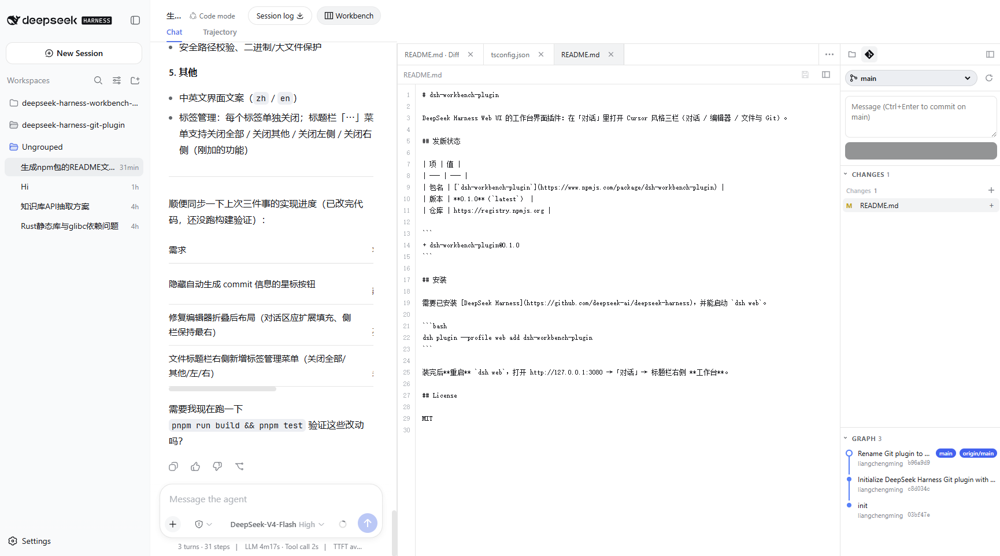

# dsh-workbench-plugin

[English](README.md) | [中文](README.zh-CN.md)

DeepSeek Harness Web UI 的工作台界面插件：在「对话」里打开 Cursor 风格三栏（对话 / 编辑器 / 文件与 Git）。



## 发版状态

| 项 | 值 |
| --- | --- |
| 包名 | [`dsh-workbench-plugin`](https://www.npmjs.com/package/dsh-workbench-plugin) |
| 版本 | **0.1.1**（`latest`） |
| 仓库 | https://registry.npmjs.org |

```
+ dsh-workbench-plugin@0.1.1
```

维护者发版：`bash devops/release.sh`（使用本机已有的 `npm login`，不要把账号密码写进仓库）。

## 安装

需要已安装 [DeepSeek Harness](https://github.com/deepseek-ai/deepseek-harness)，并能启动 `dsh web`。

```bash
dsh plugin --profile web add dsh-workbench-plugin
```

装完后**重启** `dsh web`，打开 http://127.0.0.1:3080 →「对话」→ 标题栏右侧 **工作台**。

## License

MIT
