# Mermaid 渲染测试（Markdown 预览）

> **路径**：`tests/mermaid-test.md`  
> **用途**：在工作台编辑器中打开本文件，切换到 **预览**（👁）或 **分栏** 模式，逐块检查 Mermaid 是否正常渲染。

当前渲染引擎：[beautiful-mermaid](https://www.npmjs.com/package/beautiful-mermaid)（已打进插件 `client.js`，无需额外加载 vendor 脚本）。

## 怎么判断

| 现象 | 含义 |
| --- | --- |
| 代码块变成 SVG 图表 | ✅ 当前引擎支持该语法 |
| 灰色虚线框 + 保留源码 + 顶部错误提示 | ❌ 不支持或语法有误（属预期行为） |
| 仍是普通灰色代码块、完全没有图形 | 预览未启用 Mermaid，或插件未加载 |

---

## ✅ 支持的图表（应渲染为 SVG）

### 1. 流程图 · 自上而下 `graph TD`

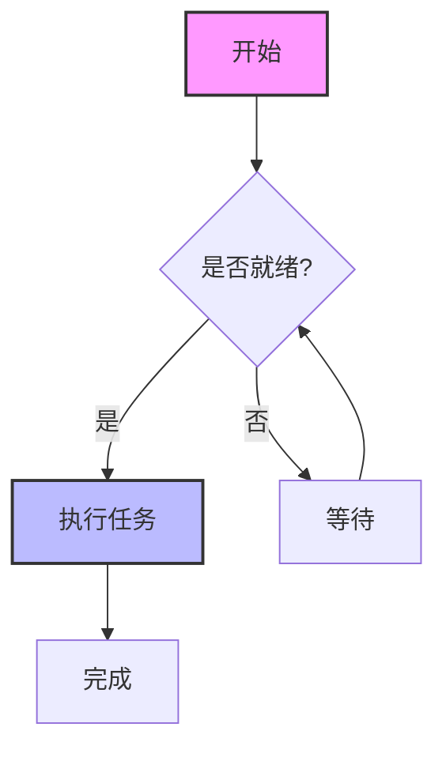

### 2. 流程图 · 自左向右 `flowchart LR`（含子图）

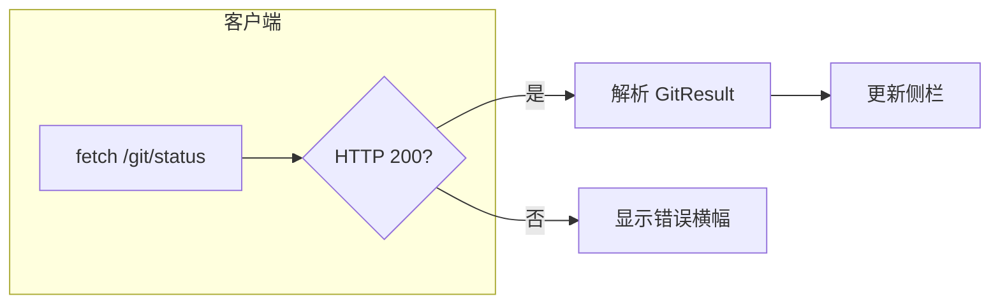

### 3. 时序图 `sequenceDiagram`（含 loop / alt）

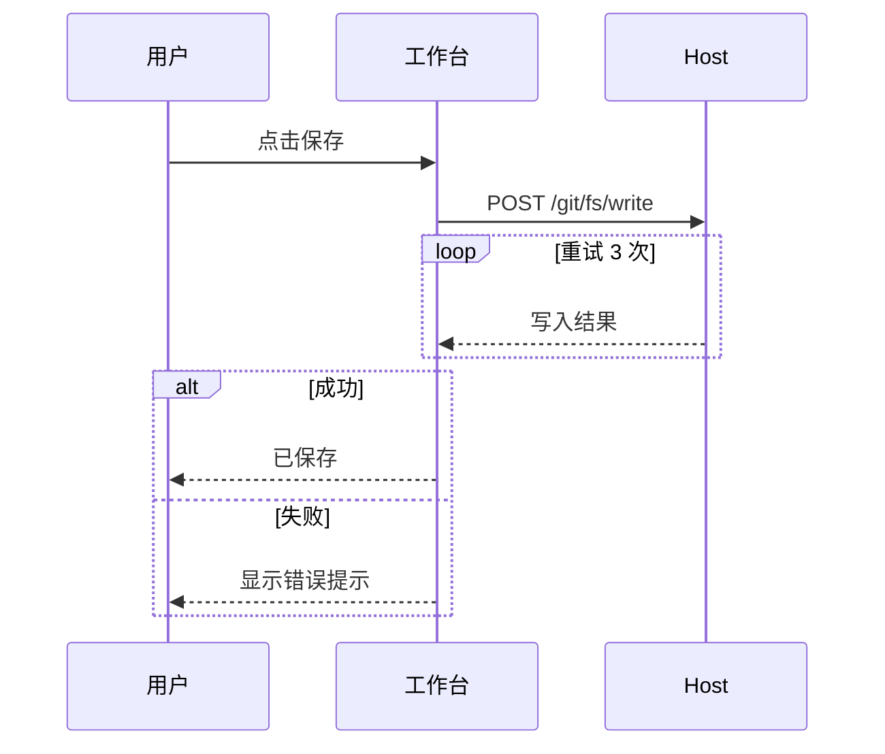

### 4. 类图 `classDiagram`

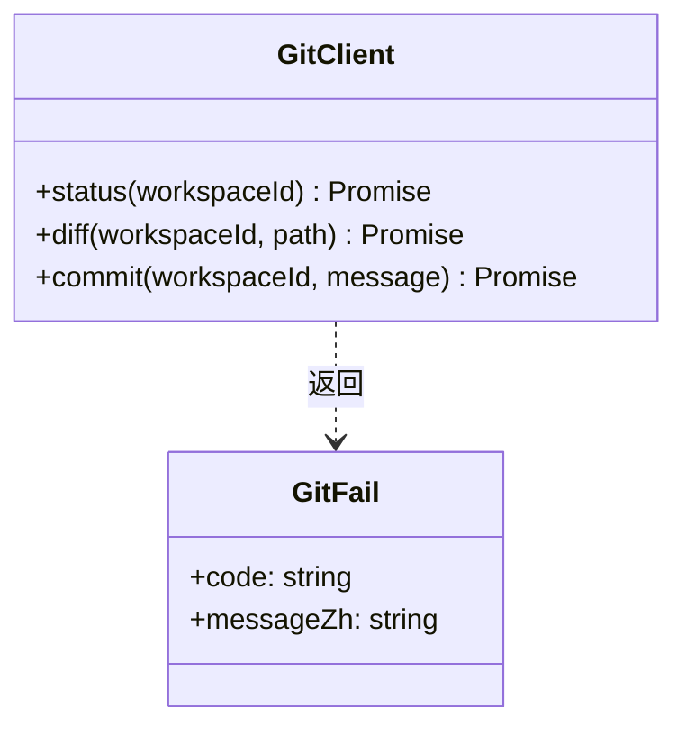

### 5. 状态图 `stateDiagram-v2`

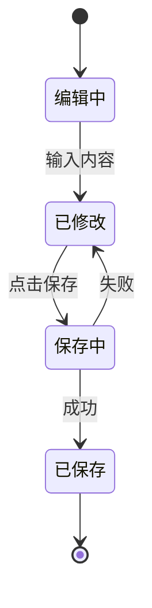

### 6. ER 图 `erDiagram`

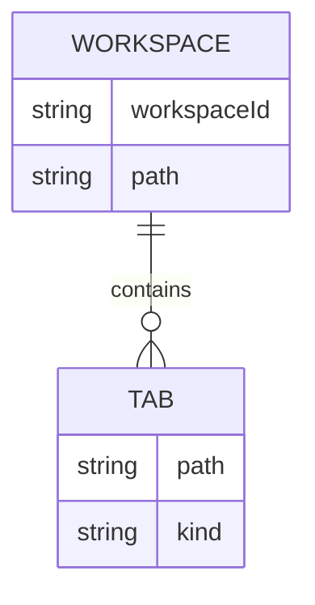

### 7. XY 图 · 柱状 `xychart-beta`（bar）

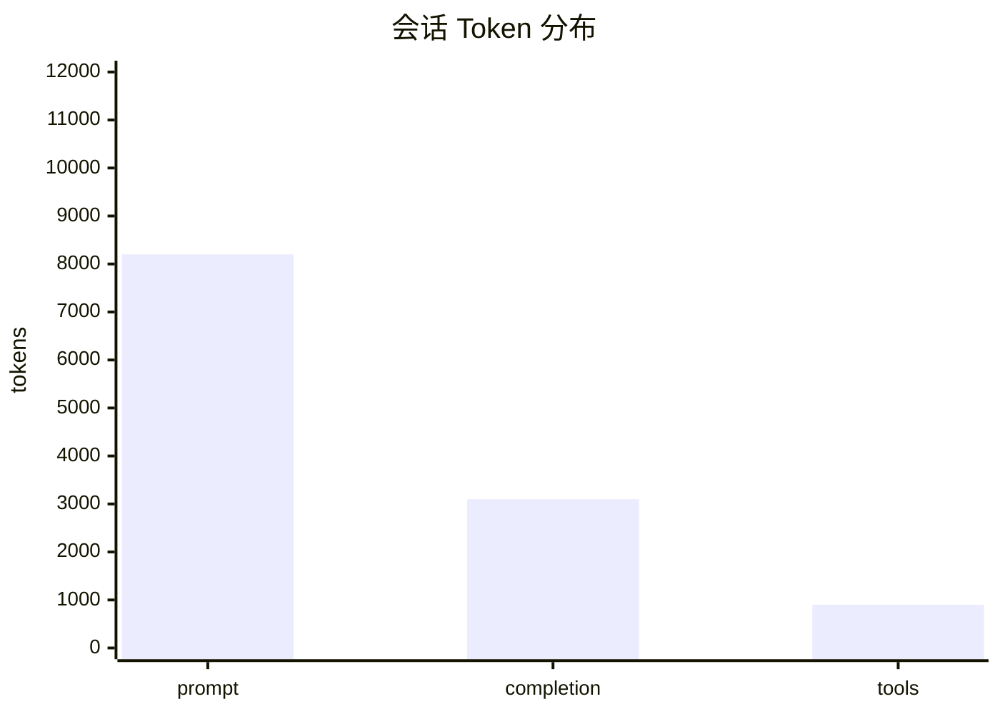

### 8. XY 图 · 折线 `xychart-beta`（line）

```mermaid
xychart-beta
    title "近 7 日用量"
    x-axis [Mon, Tue, Wed, Thu, Fri, Sat, Sun]
    y-axis "USD" 0 --> 5
    line [1.2, 0.8, 2.1, 1.5, 3.0, 0.4, 0.6]
```

### 9. XY 图 · 柱线组合

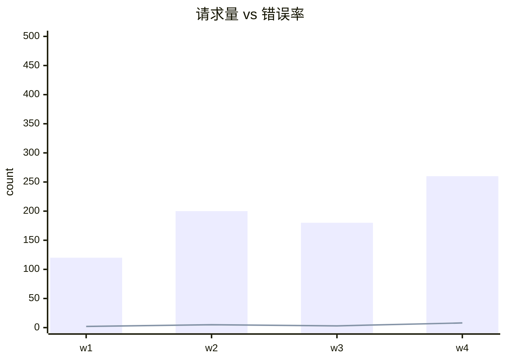

---

## ❌ 暂不支持的图表（应显示错误框并保留源码）

以下语法来自官方 Mermaid，**beautiful-mermaid 尚未实现**。预览时应出现错误提示框，而不是 SVG。

### A. 甘特图 `gantt`

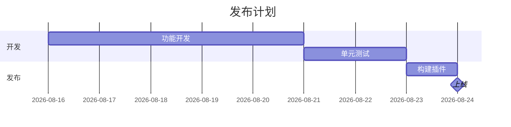

### B. 饼图 `pie`

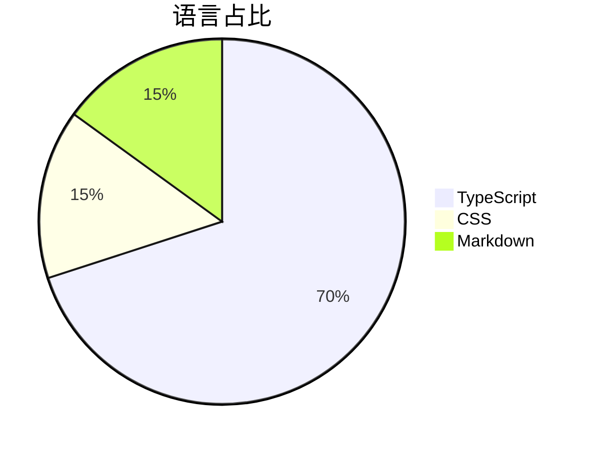

### C. 用户旅程 `journey`

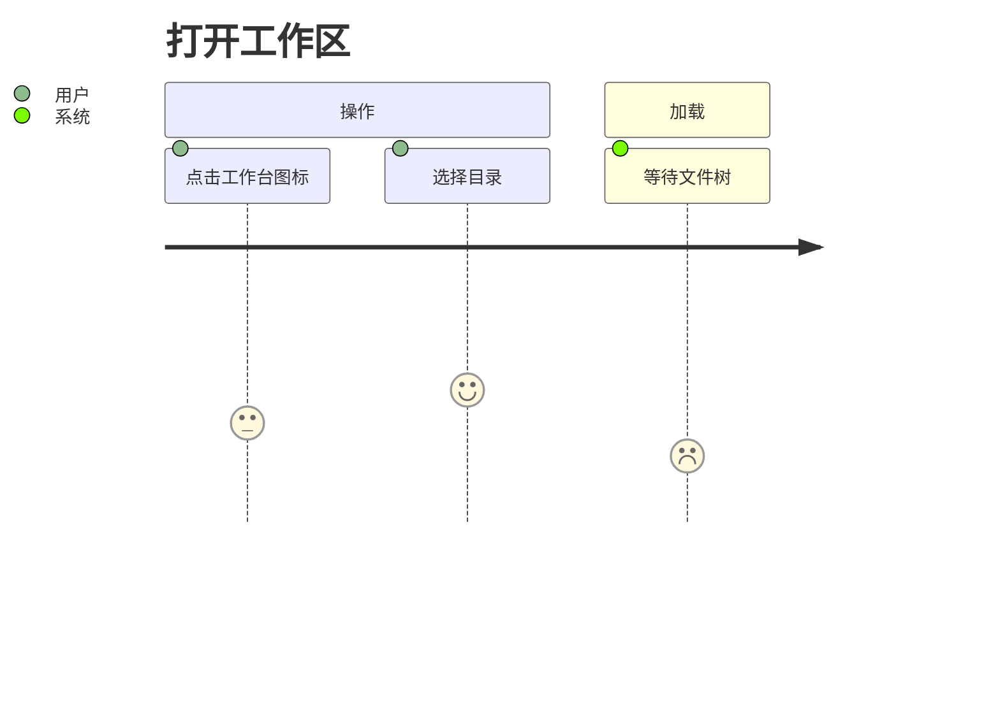

### D. 思维导图 `mindmap`

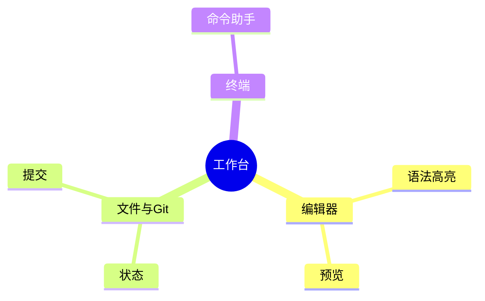

### E. 时间线 `timeline`

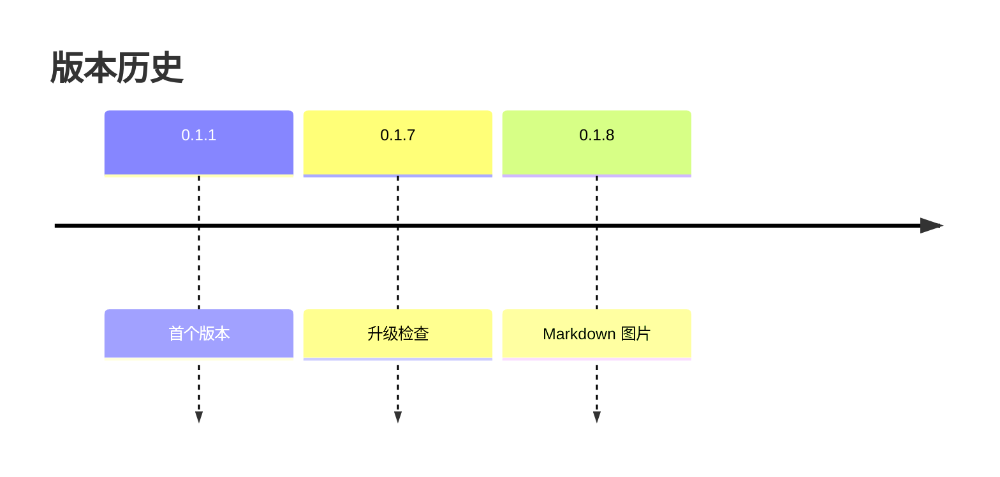

### F. Git 图 `gitGraph`

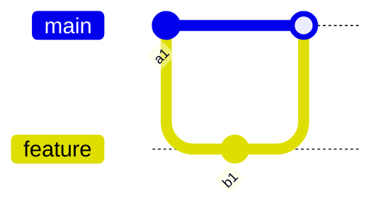

---

## 对照：普通代码块（非 mermaid）

下面应**始终**显示为代码，不会变成图表：

```text
graph TD
    A --> B
```

---

## 回归检查清单

打开 `tests/mermaid-test.md` 后快速过一遍：

1. **§1–§9** 共 9 个块 → 全部出现 SVG
2. **§A–§F** 共 6 个块 → 全部出现错误框（含原始源码）
3. 最底部 `text` 代码块 → 保持代码样式
4. 切换 **编辑 / 预览 / 分栏** 三种模式，图表不丢失、不重复
5. 切换工作台明暗主题后，图表颜色随 CSS 变量变化（无需刷新整页）

若 §1–§9 任意一块只显示代码，说明 Mermaid 渲染链路异常，请检查插件是否已 `pnpm run build` 并重新 `bash devops/dev.sh`。
