# Mermaid 渲染能力测试

本文件用于检查 Markdown 预览是否支持 [Mermaid](https://mermaid.js.org/) 图表。

**判定方法**：在编辑器中打开本文件，切到「预览」（👁）或「分栏」模式。

- ✅ **支持**：下面的 ```mermaid 代码块会渲染成对应图表（流程图、时序图、甘特图等）。
- ❌ **不支持**：所有 ```mermaid 块原样显示为灰色代码块（只看到文本，没有图形）。

---

## 1. 流程图 Flowchart（graph TD，含子图与样式）

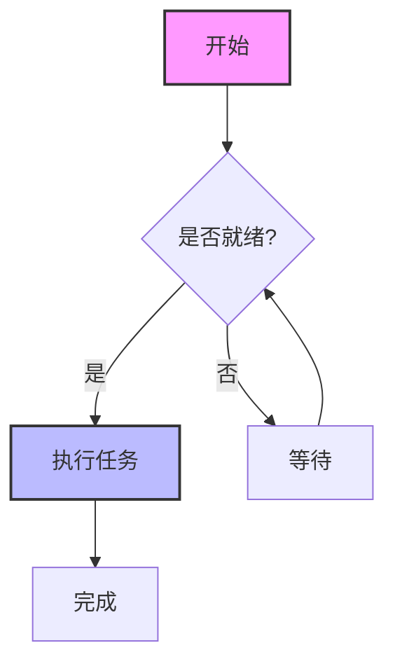

## 2. 流程图 Flowchart LR（含 HTML 标签）

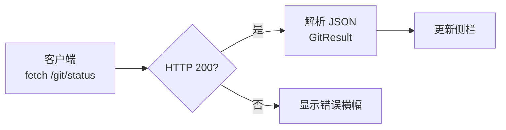

## 3. 时序图 Sequence（loop / alt）


## 4. 类图 Class

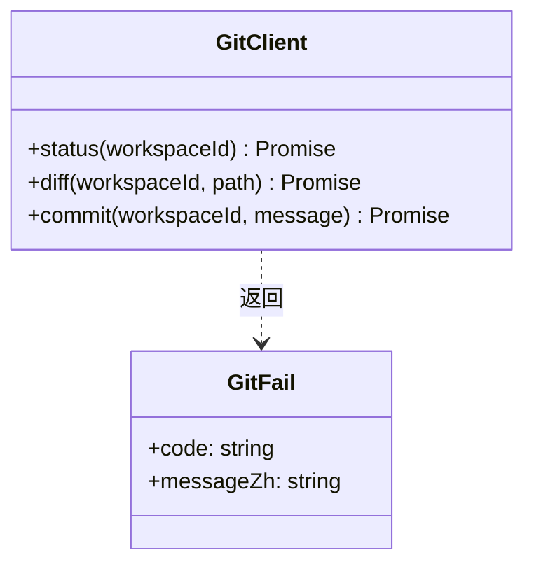

## 5. 状态图 State v2

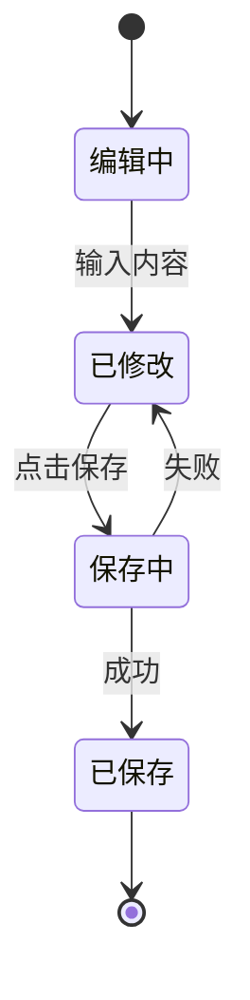

## 6. ER 图

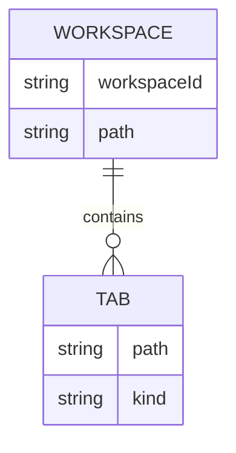

## 7. 甘特图 Gantt

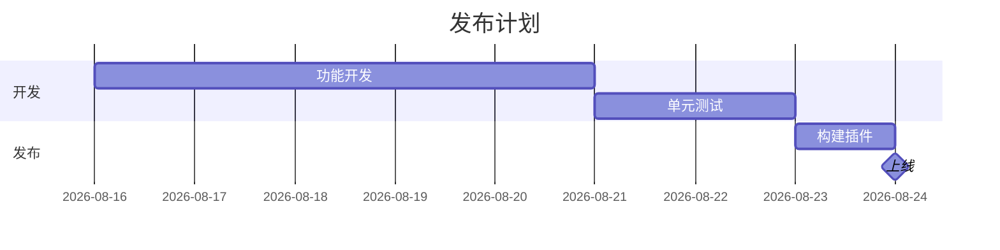

## 8. 饼图 Pie

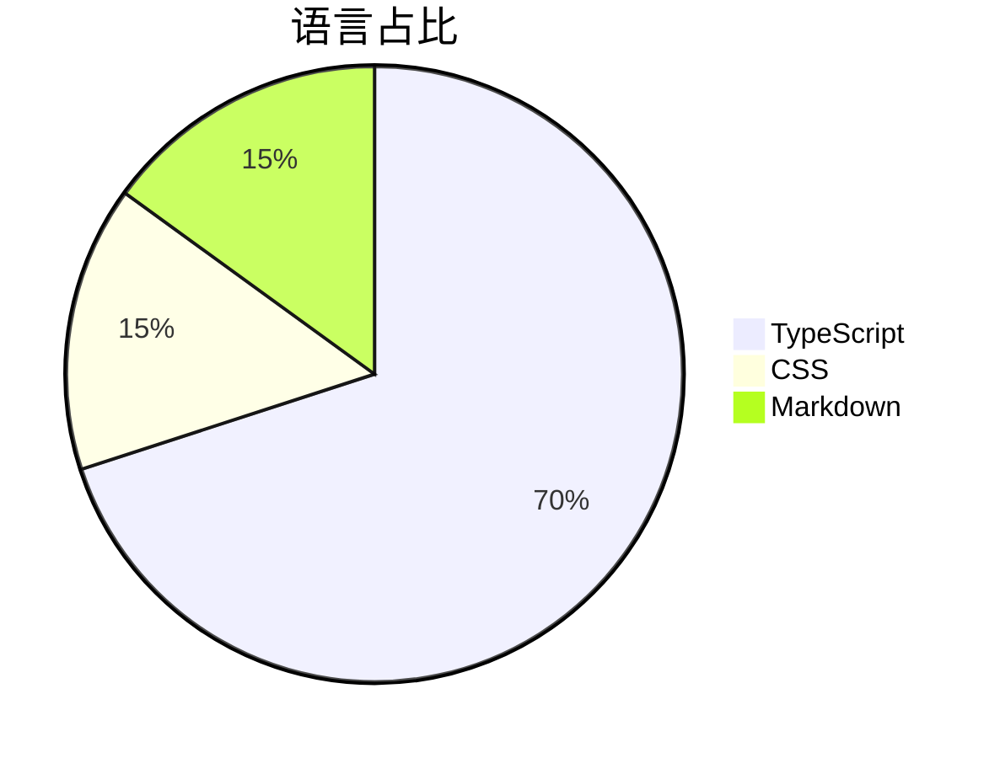

## 9. 用户旅程 User Journey

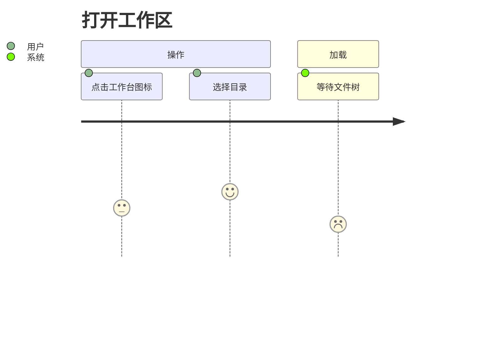

## 10. 思维导图 Mindmap

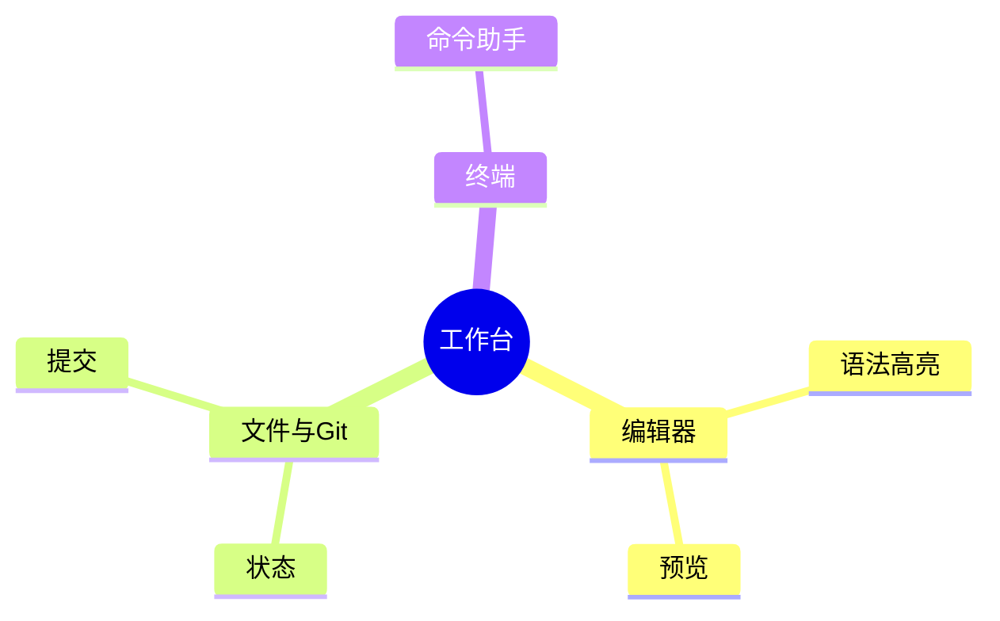

## 11. 时间线 Timeline

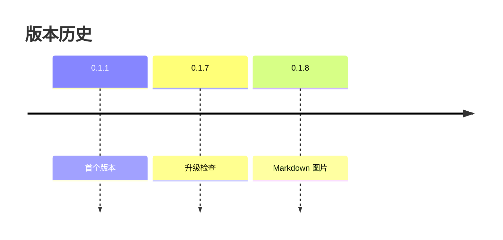

## 12. Git 图 Gitgraph

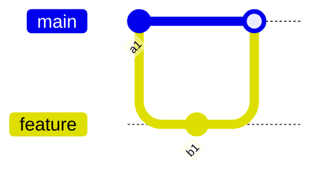

---

## 对照：普通代码块（非 mermaid，应始终显示为代码）

```text
graph TD
    A-->B
```

> 提示：如果上面所有 mermaid 块都只是代码块，说明当前预览**不支持 mermaid**；若部分支持部分不支持，可据此判断用的是哪个 mermaid 解析器（mermaid.js 8 / 9 / 10+ 对新语法支持不同）。
